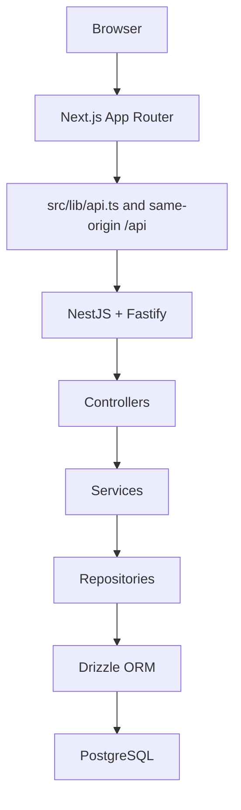

# معماری هدف Smart Manager — Phase 1

**وضعیت:** ممیزی و طراحی، بدون تغییر runtime
**تاریخ:** 2026-10-08
**مبنای محصول:** PRD نسخه 1.0، تاریخ ۱۴ مهر ۱۴۰۵

## تصمیم معماری

Smart Manager یک محصول Holding-centric است. ساختار موجود Next.js و NestJS حفظ می‌شود و قابلیت‌های سازمانی در همین برنامه توسعه می‌یابند. API روی NestJS/Fastify و PostgreSQL از طریق Drizzle است. لایه‌ی هدف برای عملیات دامنه: Controller → Service → Repository؛ Drizzle queryها در Repository قرار می‌گیرند و Service مالک قواعد کسب‌وکار و هماهنگی فرایند است.

## نقشه‌ی فعلی

- وب در src/app از App Router و route گروه‌های auth/workspace استفاده می‌کند. workspace بسیاری از URLها را با route پویای [...segments] و route-catalog مدیریت می‌کند.
- src/lib/api.ts پاسخ envelope شده‌ی API را باز می‌کند. رابط کاربری فعلی از shared shell و viewهای workspace استفاده می‌کند؛ Tailwind v4 و shadcn برای بخشی از shell/table به کار رفته و بقیه‌ی viewها هنوز ساختار Dashlite دارند.
- apps/api/src/main.ts برنامه را با Fastify، cookie، helmet، multipart، prefix برابر /api و Swagger در /api/docs اجرا می‌کند.
- AppModule ماژول‌های Auth، Authorization، Users، Organizations، KPI، Corrective Actions، Dashboard، Data، Inbox/Audit، Settings، Module Platform و SMS را فعال می‌کند.
- CoreModule پاسخ envelope، exception filter، validation و ترجمه‌ی fa/en را فراهم می‌کند.
- Repositoryها Drizzle را برای PostgreSQL فراخوانی می‌کنند. بعضی repositoryهای KPI و Corrective Actions علاوه بر persistence بخشی از workflow و authorization را هم اجرا می‌کنند؛ این مرزبندی باید در توسعه‌های بعدی شفاف بماند.

## منبع فعلی هویت و مجوز

- احراز هویت فعال در apps/api/src/common/session.service.ts و SessionGuard انجام می‌شود؛ جزئیات در سند JWT آمده است.
- نقش فعال روی users.role با مقادیر admin/user قرار دارد.
- مجوزها از knownPermissions و aliasها در API فعال، role_permissions و access_level_permissions حل می‌شوند.
- departmentId و accessLevelId روی user فعلی هستند و بعضی queryها از department به‌عنوان data scope استفاده می‌کنند.
- Feature modules and the retained Auth/Role/Permission boilerplate live under `apps/api/src/module`; runtime modules are registered from `apps/api/src/app.module.ts`. The repository-root `/modules` directory does not exist.

## مقصد سازمانی و دامنه

Holding → Company → Branch → Business Unit → Memberships

هر Company دارای KPI، Dashboard، Action، Decision، Meeting، Alert، Audit و AI Context در محدوده‌ی دسترسی خود است.

- User هویت سراسری است؛ Membership عضویت او در یک holding/company و نقش/دامنه‌ی مربوط را مشخص می‌کند. یک user می‌تواند چند membership داشته باشد.
- Role و permission پویا هستند و role assignment به membership وصل می‌شود.
- هر رکورد سازمانی مالکیت شرکت/واحد مشخص دارد. scope از AuthContext معتبر سرور به query می‌رسد.
- Holding access، company access، branch/unit access و own/assigned/domain scope از هم جدا هستند.
- Dashboard و report از read serviceهای مجاز ساخته می‌شوند. فقط KPIهای هم‌تعریف و قابل مقایسه در سطح گروه aggregate می‌شوند.
- Audit و evidence در محدوده‌ی سازمانی همان رکورد کنترل می‌شوند.

## مرزبندی دامنه‌های محصول

- Identity & Access: user، invitation، membership، role، permission، JWT/session و switch company.
- Organization: holding، company، branch، business unit، calendar و data owner.
- Performance: KPI definition/version، formula، target، source، submission/review/reject، period lock و WBR/MBR. در پایلوت ثبت‌کننده خودش submission را approve نمی‌کند.
- Red Flag: هشدار مستقل با حالت‌های new/reviewed/actioned/resolved/closed و evidence؛ نبود علت نیز ثبت می‌شود.
- Action & Decision: تصمیم جلسه از Action جداست؛ یک Decision چند Action دارد. Action از proposed/approved/in progress/blocked/pending approval/closed/cancelled عبور می‌کند. progress از 0 تا 100 با approval تکمیل یکی نیست؛ تغییر owner/deadline نیازمند approval مدیر اجرایی است.
- Dashboard/Reporting: داشبورد ثابت شش‌بخشی CEO/COO با هدف یافتن issue/cause/owner/deadline/intervention در کمتر از پنج دقیقه؛ فیلتر و drill-down کنترل‌شده. Reminder و escalation قابل تنظیم و idempotent هستند.
- Audit/Evidence/Notification: تغییر حساس با actor/time/company/old/new/reason، مدرک، inbox و یادآوری ثبت می‌شود.
- Integrations/AI: اتصال read-only و fallback فایل؛ AI فقط با دسترسی منبع، citation و audit.

## اصول طراحی

1. هر request حساس باید AuthContext معتبر و membership فعال داشته باشد.
2. companyId ارسالی از client تنها انتخاب درخواستی است؛ backend عضویت را validate کرده و context را resolve می‌کند.
3. authorization دو بخش دارد: مجوز عمل و scope رکورد.
4. نبود scope لازم یعنی رد درخواست؛ query بدون scope نباید همه‌ی داده را برگرداند.
5. admin فنی خودکار مجوز تجاری همه‌ی شرکت‌ها نمی‌گیرد.
6. PMO می‌تواند مشاهده، review، درخواست اصلاح و escalation انجام دهد؛ owner/deadline/close در اختیار مدیر اجرایی مجاز می‌ماند.
7. progress درصدی معادل تأیید تکمیل نیست.
8. KPI، Red Flag، Action و Decision باید تاریخچه و audit قابل پیگیری داشته باشند.
9. UI مجوز را نمایش می‌دهد؛ enforcement فقط در API/query انجام می‌شود.

## موارد نیازمند تصمیم محصول

- hierarchy نهایی و مالکیت Company در برابر Branch/Business Unit برای هر دامنه.
- نقش‌ها و scope دقیق GROUP_CEO، GROUP_COO، PMO، PMO_REVIEWER، COMPANY_CEO، PNL_OWNER، SALES_MANAGER، FINANCE_MANAGER، HR_MANAGER، OPERATIONS_MANAGER، DATA_OWNER، DATA_ENTRY، KPI_REVIEWER و TECHNICAL_ADMIN.
- عضویت هم‌زمان یک فرد در چند شرکت و انتخاب membership پیش‌فرض.
- permission catalog و قواعد permission scope/domain.
- سیاست access/refresh token، MFA، CSRF، session revocation و عمر توکن.
- معیار comparability برای KPIهای گروهی، ارز، تقویم و reporting period.
- سیاست retention و مجوز فایل، export، audit و AI retrieval.

## دامنه‌ی این مرحله

این اسناد وضعیت موجود و طراحی سیستم Smart Manager را ثبت می‌کنند. در Phase 1 تغییری در runtime، schema، route یا dependency انجام نمی‌شود.